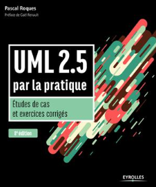
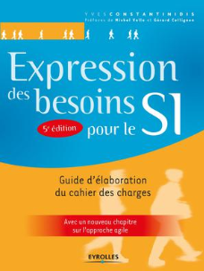
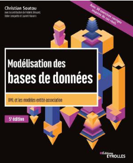
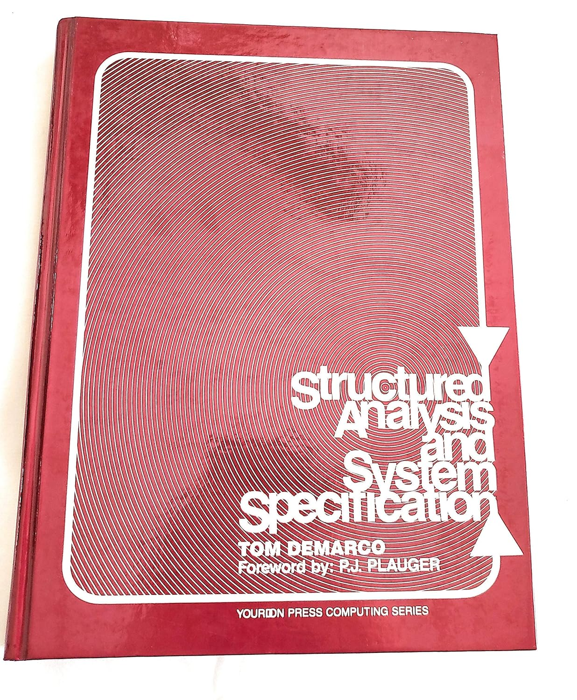

# UML et conception orientée objet

- [UML et conception orientée objet](#uml-et-conception-orientée-objet)
  - [Templates](#templates)
  - [Ressources utiles](#ressources-utiles)
    - [Bibliographie](#bibliographie)
    - [*Méthodes* de conception logicielle](#méthodes-de-conception-logicielle)
    - [Langages de modélisation](#langages-de-modélisation)
  - [Logiciels](#logiciels)

## Fiche de problèmes (pratique)

- [Accéder à la fiche](./problemes-clean.md)

## Templates

- [Accéder aux templates](./templates/)

## Ressources utiles

### Bibliographie

- [UML 2.5 par la pratique](https://www.scholarvox.com/catalog/book/docid/88855423), de Pascal Roques, publié chez Eyrolles, 2018. Mieux maîtriser l'UML, avoir des outils pour analyser, représenter, documenter et *communiquer* sur/son système
- [Expression des besoins pour le SI : Guide d'élaboration du cahier des charges](https://www.scholarvox.com/catalog/book/docid/88935607?searchterm=Expression%20des%20besoins%20pour%20le%20SI), d'Yves Constantinidis, publié chez Eyrolles (2022). Un classique qui vous donne un ensemble d'outils, de conseils pratiques (et éprouvés !) et de *méthodes* pour recueillir et formaliser les besoins
- [Structured Analysis and System Specification](https://www.amazon.com/Structured-Analysis-System-Specification-DeMarco/dp/0138543801), de [Tom DeMarco](https://en.wikipedia.org/wiki/Tom_DeMarco), publié chez Pentice Hall (1978). Un livre remarquable et concis sur les méthodes et outils pour la spécification de systèmes informatiques (*Structured analysis*). Pour mieux comprendre et utiliser les *Data Flow Diagrams* et autres outils
- [Modélisation des bases de données : UML et les modèles entité-association](https://www.eyrolles.com/Informatique/Livre/modelisation-des-bases-de-donnees-9782416007507/), de Christian Soutou (et Frédéric Brouard), publié chez Eyrolles (2022). S'il y a un livre francophone à se procurer sur la conception de bases de données relationnelles, c'est celui-ci. Une référence. **LP++**. Apprendre à bien concevoir ses schémas de bases de données et décomposer ses données (entités, associations et cardinalités). Avec exercices corrigés. **Excellent ouvrage**

### *Méthodes* de conception logicielle

- [OMT](https://fr.wikipedia.org/wiki/Object_modeling_technique)
- [Booch](https://fr.wikipedia.org/wiki/M%C3%A9thode_Booch)
- [Merise](https://fr.wikipedia.org/wiki/Merise_(informatique))
- [Méthode Agile](https://fr.wikipedia.org/wiki/M%C3%A9thode_agile)
- [Extreme Programming](https://fr.wikipedia.org/wiki/Extreme_programming)

### Langages de modélisation

- UML
- [OOSE](https://fr.wikipedia.org/wiki/Object_Oriented_Software_Engineering)
- [BON](https://en.wikipedia.org/wiki/Business_Object_Notation)
- [Modèle Entité-Association](https://fr.wikipedia.org/wiki/Mod%C3%A8le_entit%C3%A9-association), spécifique aux bases de données

## Logiciels

- [UMLet](https://www.umlet.com/), un logiciel gratuit et open source pour dessiner rapidement des diagrammes UML et les exporter. Développé en Java donc cross-platform. **Parfait pour du dessin rapide et du partage** (chaque diagramme est enregistré sous la forme d'un code source). **Ne permet pas de se servir des diagrammes pour générer du code**.
- [UMLet extension VS code](https://marketplace.visualstudio.com/items?itemName=TheUMLetTeam.umlet), UMLet peut être intégré directement dans VS Code. Il existe également [un plugin pour Eclipse](https://www.umlet.com/changes.htm)
