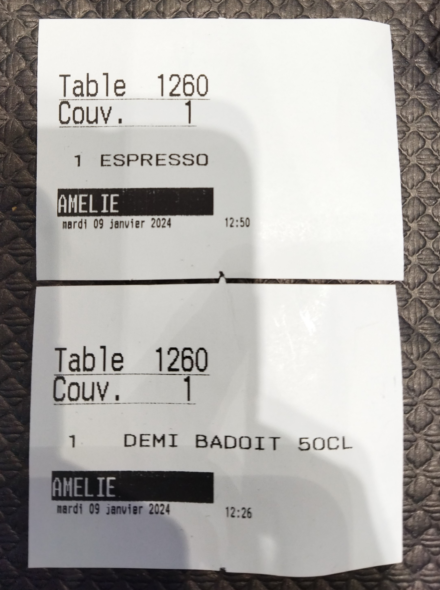
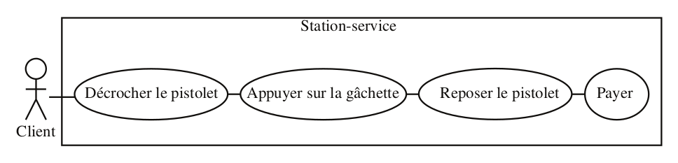
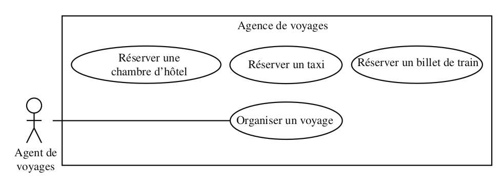
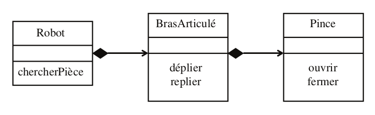

# Exercices de modélisation UML

Notions abordées: 

- Modélisation des objets
- Classes
- Relations
- Interface
- Héritage
- Dépendances
- Cas d'utilisation

Diagrammes UML abordés: 

- Diagramme d'objets
- Diagramme de classes
- Diagramme de cas d'utilisation
- Diagramme de séquence
- Diagramme de communication
- Diagramme d'états transitions
- Diagramme d'activités

<!-- 
La majorité des exercices présentés ici sont tirés du livre "UML2 Pratique de la modélisation, 2eme édition 2009, publié chez collection Synthexn, Pearson Education. Voir Biblio
-->

## Exercice 1: Propriétés d'une classe

**Proposez une modélisation**, en vue d’une implémentation informatique, de la situation
suivante en mettant en évidence les différents compartiments et ornements des classes.
Réalisez la modélisation étape par étape, en faisant apparaître, en fonction des connaissan-
ces disponibles, les changements du modèle.

1. Une personne est caractérisée par son nom, son prénom, son sexe et son âge. Les respon-
sabilités de la classe sont entre autres le calcul de l’âge, le calcul du revenu et le paiement
des charges. Les attributs de la classe sont privés ; le nom, le prénom ainsi que l’âge de la
personne font partie de l’interface de la classe Personne.

2. Deux types de revenus sont envisagés, le salaire et toutes les sources de revenus autres
que le salaire, qui sont tous deux représentés par des entiers. On calcule les charges en
appliquant un coefficient fixe de 15 % sur les salaires et un coefficient de 20 % sur les
autres revenus.

3 Un objet de la classe Personne peut être créé, en particulier, à partir du nom et de la date
de naissance. Il est possible de changer le prénom d’une personne. Par ailleurs, le calcul
des charges ne se fait pas de la même manière lorsque la personne décède.

## Exercice 2 : Classe stéréotypée

En trigonométrie, on a besoin de calculer le sinus, le cosinus, la tangente des angles et la
valeur du nombre PI. La classe `Angle` existe déjà. 

**Proposez** une structure qui regroupe ces fonctions.

## Exercice 2.2 : Diagramme de classes

Voici deux tickets émis par un bistrot pour un client.

A partir des informations sur les tickets et de votre connaissance du métier, **proposer un diagramme de classes** modélisant le SI du bistrot. On ne fera figurer sur le diagramme de classes que les noms des classes, propriétés (attributs) et associations entre classes.

## Exercice 3 : Identification des acteurs et recensement des cas d'utilisation

Considérons le système informatique qui gère une station-service de distribution d’essence.
On s’intéresse à la modélisation de la prise d’essence par un client.

1. Le client se sert de l’essence de la façon suivante. Il prend un pistolet accroché à une
pompe et appuie sur la gâchette pour prendre de l’essence. Qui est l’acteur du système ?
Est-ce le client, le pistolet ou la gâchette ? Faire un diagramme de cas d'utilisation.
2. Le pompiste peut se servir de l’essence pour sa voiture. Est-ce un nouvel acteur ?
3. La station a un gérant qui utilise le système informatique pour des opérations de gestion.
Est-ce un nouvel acteur ?
4. La station-service a un petit atelier d’entretien de véhicules dont s’occupe un mécani-
cien. Le gérant est remplacé par un chef d’atelier qui, en plus d’assurer la gestion, est
aussi mécanicien. Comment modéliser cela ?

## Exercice 4 : Relations entre cas d'utilisation

Quel est le défaut du diagramme suivant ?

## Exercice 5 : Cas internes

**Choisissez** et **dessinez** les relations entre les cas suivants :

1. Une agence de voyages organise des voyages où l’hébergement se fait en hôtel. Le client
doit disposer d’un taxi quand il arrive à la gare pour se rendre à l’hôtel.

2. Certains clients demandent à l’agent de voyages d’établir une facture détaillée. Cela donne
lieu à un nouveau cas d’utilisation appelé « Établir une facture détaillée ». Comment
mettre ce cas en relation avec les cas existants ?

3. Le voyage se fait soit par avion, soit par train. Comment modéliser cela ?

## Exercice 6 : Identification des acteurs, recensement des cas d'utilisation et relations entre cas

**Modélisez** avec un diagramme de cas d’utilisation le fonctionnement d’un distributeur
automatique de cassettes vidéo dont la description est donnée ci-après.

Une personne souhaitant utiliser le distributeur doit avoir une carte magnétique spéciale.
Les cartes sont disponibles au magasin qui gère le distributeur. Elles sont créditées d’un
certain montant en euros et rechargeables au magasin. Le prix de la location est fixé par
tranches de 6 heures (1 euro par tranche). Le fonctionnement du distributeur est le sui-
vant : le client introduit sa carte ; si le crédit est supérieur ou égal à 1 euro, le client est
autorisé à louer une cassette (il est invité à aller recharger sa carte au magasin sinon) ; le
client choisit une cassette et part avec ; quand il la ramène, il l’introduit dans le distribu-
teur puis insère sa carte ; celle-ci est alors débitée ; si le montant du débit excède le crédit
de la carte, le client est invité à régulariser sa situation au magasin et le système mémorise
le fait qu’il est débiteur ; la gestion des comptes débiteurs est prise en charge par le person-
nel du magasin. On ne s’intéresse ici qu’à la location des cassettes, et non à la gestion du
distributeur par le personnel du magasin (ce qui exclut la gestion du stock des cassettes).

## Exercice 7 : Description textuelle d'un cas d'utilisation

**Décrivez sous forme textuelle** les cas d’utilisation « Emprunter une vidéo » du diagramme de l'exercice 6. 

La recherche d’une vidéo peut se faire par genres ou par titres de film. Les différents genres sont action, aventure, comédie et
drame. Quand une liste de films s’affiche, le client peut trier les films par titres ou par dates
de sortie en salles.

## Exercice 8 : Relations entre acteurs, extensions conditionnelles entre cas d'utilisation

**Modélisez** à l’aide d’un diagramme de cas d’utilisation une médiathèque dont le fonction-
nement est décrit ci-après. Commencez par identifier les acteurs.

Une petite médiathèque n’a qu’une seule employée qui assume toutes les tâches :

- la gestion des œuvres de la médiathèque ;
- la gestion des adhérents.

Le prêt d’un exemplaire d’une œuvre donnée est limité à trois semaines. Si l’exemplaire
n’est pas rapporté dans ce délai, cela génère un contentieux. Si l’exemplaire n’est toujours
pas rendu au bout d’un an, une procédure judiciaire est déclenchée.

L’accès au système informatique est protégé par un mot de passe.

## Exercice 9 : Relations simples

**Donner** les diagrammes de classes correspondant aux situations suivantes :

1. Les personnes qui sont associées à l’université sont des étudiants ou des professeurs.
2. Un rectangle est caractérisé par quatre sommets. Un sommet est un point. On construit
un rectangle à partir des coordonnées de quatre sommets. Il est possible de calculer sa
surface et son périmètre et de le translater.
3. Un écrivain possède au moins une œuvre. Ses œuvres sont ordonnées selon l’année de
publication. Si la première publication est faite avant l’âge de dix ans, l’écrivain est dit
*précoce*.
4. Tous les jours, le facteur distribue le courrier aux habitants de sa zone d’affectation.
Quand il s’agit de lettres, il les dépose dans les boîtes aux lettres. Quand il s’agit d’un
colis, le destinataire du courrier doit signer un reçu. Proposez les classes candidates et
déduisez-en le diagramme de classes.

<!-- ### Exercice 10 : Relations

Une commande est liée à plusieurs produits. À chaque produit de la commande sont asso-
ciées des dates.

1. Donnez une modélisation UML de l’association entre ces trois classes.
Plus précisément, deux dates sont affectées à chaque produit d’une commande, une
date et un produit sont associés à une seule commande et, à une commande et une date
donnée sont liés deux à dix produits.
2. Complétez la modélisation UML de l’application.
Soit la base de données suivante : (commande, produit, date) = {(c1,p1,d1), (c1,p2,d2),
(c2,p1,d2), (c2,p4,d4)}.
3. Vérifiez qu’elle respecte bien le diagramme UML de la question 1. Sinon, ajoutez-lui les
tuples nécessaires pour la rendre conforme. -->

## Exercice 10 : Héritage

Un étudiant et un enseignant sont des personnes particulières.

1. Proposez un modèle de classes correspondant.
Un doctorant est un étudiant qui assure des enseignements. La modélisation sera suivie
par une implémentation dans le langage objet de votre choix (PHP,C++,C#,Java,etc.).
2. Complétez le modèle de classes précédent en exploitant au mieux les possibilités du lan-
gage cible.
Un doctorant et un étudiant doivent s’inscrire au début de l’année et éventuellement
modifier leur inscription. En fonction des deux modèles proposés.
3. Ajoutez cette fonctionnalité aux deux précédents modèles.

<!-- ### Exercice  : Nom d'une classe et paquetage

La classe `Livre` est définie dans le paquetage `Ressource` se trouvant lui-même dans le paque-
tage `Bibliothèque`. Parmi les attributs de la classe `Livre` figurent le nom de type `String` se
trouvant dans le paquetage `Base` et l’emprunteur de type `Adhérent` se trouvant dans le
paquetage `Bibliothèque`. 

**Donnez la représentation graphique** de la classe `Livre` en indiquant le chemin complet des classes. -->

<!-- ### Exercice 6

Les étudiants peuvent être comparés par rapport à l’attribut moyenne générale et les livres
sont comparables par rapport à leurs prix de vente. Pour des raisons d’homogénéité des
interfaces présentées par les classes, tous les objets comparables utilisent la même opération
compareTo(Instance). Proposez le diagramme de classes mettant en évidence l’opération de
comparaison. -->

<!-- ### Exercice 11 : Classe active

Votre téléphone mobile dispose d’un gestionnaire d’événements qui permet de suspendre
l’activité du téléphone lorsque celui-ci n’est pas sollicité, d’afficher un message quand un
rendez-vous est programmé. 

**Proposer** une modélisation UML de ce gestionnaire d’événements. -->

<!-- ### Exercice supplémentaire

Question 12 Définissez la classe UML représentant un étudiant, caractérisé, entre
autres, par un identifiant, un nom, un prénom et une date de naissance.
Question 13 Définissez la classe UML représentant un enseignant, caractérisé, entre
autres, par un identifiant, un nom, un prénom et une date de naissance.
Question 14 Définissez la classe UML représentant un cours, caractérisé par un identi-
fiant, un nom, le nombre d’heures de cours magistral, le nombre d’heures
de travaux dirigés et un nombre d’heures de travaux pratiques que doit
suivre un étudiant.
Question 15 Définissez les associations qui peuvent exister entre un enseignant et un
cours.
Question 16 Définissez la classe UML représentant un groupe d’étudiants en utilisant
les associations.
Question 17 Définissez l’association possible entre un groupe d’étudiants et un cours.
Question 18 Pensez-vous qu’il soit possible de définir un lien d’héritage entre les classes
UML représentant respectivement les étudiants et les enseignants ?
Question 19 Pensez-vous qu’il soit possible de définir un lien d’héritage entre les classes
UML représentant respectivement les étudiants et les groupes d’étudiants ?
23
Question 20 On nomme coursDeLEtudiant() l’opération permettant d’obtenir l’ensemble
des cours suivis par un étudiant. Positionnez cette opération dans une
classe, puis précisez les paramètres de cette opération, ainsi que les
modifications à apporter aux associations préalablement identifiées pour
que votre solution soit réalisable.
Question 21 On nomme coursDeLEnseignant() l’opération permettant d’obtenir
l’ensemble des cours dans lesquels intervient un enseignant. Positionnez
cette opération dans une classe, puis précisez les paramètres de cette
opération, ainsi que les modifications à apporter aux associations préala-
blement identifiées pour que votre solution soit réalisable.

Question 23 Positionnez toutes vos classes ( Etudiant , Enseignant ,
GroupeEtudiant ) dans un package nommé Personnel .
Cours ,
Question 24 Liez vos classes pour faire en sorte qu’un créneau soit lié à un cours ! -->

## Exercice 11 : Aspect dynamique, traduction d'un diagramme de séquence en diagramme de communication

Le diagramme de classes présenté à la figure ci-dessous modélise un robot qui dispose d’un bras
articulé se terminant par une pince. Le fonctionnement du robot est le suivant : le robot
déplie son bras, attrape la pièce avec sa pince, replie son bras puis relâche la pièce.

1. **Représenter** à l’aide d’un diagramme de séquence l’échange des messages entre les
objets robot, brasArticulé et pince.
2. **Transformer** le diagramme de séquence en un diagramme de communication.
3. **Écriver** en pseudo-code les classes Robot, BrasArticulé et Pince.

## Exercice 12 : Diagramme d'états-transitions

**Représenter** par un diagramme d’états-transitions les états que peut prendre un individu
du point de vue de l’INSEE : vivant, décédé, mineur, majeur, célibataire, marié, veuf et
divorcé.

## Exercice 13 : Diagramme d'états-transitions

Une porte munie d’une serrure offre les opérations ouvrir, fermer, verrouiller, déverrouiller
et franchir. La serrure peut être fermée à simple ou à double tour.

**Modéliser** les états et transitions de la serrure. Mettez en avant les états
où la serrure est verrouillée par rapport aux états où elle ne l’est pas.

## Exercice 14: Diagramme d'activités

Un site de vente en ligne propose des produits, placés dans un panier virtuel tandis que
l’utilisateur navigue. Pour valider ses achats, il clique sur le bouton Sortir du magasin. On lui
propose alors de se connecter à un compte existant, ou d’en créer un s’il n’en a pas encore.
Pour créer un nouveau compte, l’utilisateur doit fournir une adresse de messagerie, qui
sert également de login, son nom et son adresse, éventuellement une adresse de livraison,
et ses coordonnées bancaires. On prévoit le cas où l’adresse de messagerie est déjà associée
à un compte. Si la validation de ces informations réussit, on crée un nouveau compte et
l’on propose à l’utilisateur de s’y connecter. On passe ensuite à la confirmation des achats.

**Modéliser** cette procédure à l’aide d’un diagramme d’activités.

<!-- ## Exercice 3

Complétez les messages des figures 3.35 à 3.39 en choisissant le type de message approprié
(synchrone ou asynchrone).
1. Envoi d’un message pour calculer la valeur de la constante pi avec 3 décimales.
Figure 3.35
Calcul de Pi avec
3 décimales.
: ProgrammePrincipal
Envoi du message
Message de réponse
: FonctionDeCalculDePi
calculerPI( nombreDécimales = 3 )
PI = calculerPI( nombreDécimales = 3 )
2. Envoi d’un message pour calculer la valeur de pi avec 3 000 décimales.

Transmission d’un courrier électronique.
Figure 3.37
: Émetteur
Transmission
d’un courrier
électronique.
: Destinataire
transmettre( message )
4. Transmission d’un courrier électronique via un serveur de messagerie qui réceptionne
les messages et les conserve le temps que le destinataire les récupère.
Figure 3.38
Transmission
d’un courrier
électronique
via un serveur
de messagerie.
: Émetteur
: ServeurDeMessagerie
: Destinataire
poster( message )
message = récupérer
5. Transmission d’un courrier électronique à deux destinataires.
Figure 3.39
Transmission d’un
courrier à deux
destinataires.
: Émetteur
destinataire1 : Destinataire
destinataire -->

<!-- ## Exercice 4

Le diagramme de cas d’utilisation présenté à la figure 3.53 modélise la gestion simplifiée
d’une bibliothèque.
Figure 3.53
Gestion des emprunts
Bibliothécaire
Le fonctionnement de la bibliothèque est le suivant : une bibliothèque propose à ses adhé-
rents des œuvres littéraires ; les œuvres peuvent être présentes en plusieurs exemplaires ;
un adhérent peut emprunter jusqu’à trois livres.
Écrivez à l’aide d’un diagramme de séquence un scénario nominal d’emprunt.
2. Écrivez à l’aide de diagrammes de séquence des scénarios d’emprunt alternatifs et
d’exceptions.

## Exercice 5

Le diagramme de séquence de l’exercice 4 (figure 3.61) représente la fin du scénario nomi-
nal de l’emprunt (partie entourée par un cercle dans le diagramme de la figure 3.59). Sup-
primez la partie encerclée du scénario nominal et indiquez comment vous pouvez
réutiliser le diagramme de séquence de la figure 3.61 à la place. -->

<!-- ## Exercice 6 (Diagramme d'(activité)

Les chaînes de caractères du langage C sont codées comme un tableau de caractères non
nuls, terminé par un caractère ’\0’ . Par exemple, la chaîne s="hello!" est codée
comme suit :
s[0] s[1] s[2] s[3] s[4] s[5] s[6]
‘h’ ’e’ ’l’ ’l’ ’o’ ’!’ ’\0’
Décrivez une activité implémentant la fonction strlen , qui prend en entrée un tableau
de caractères et rend un entier correspondant à la taille de la chaîne. Exemple :
strlen("hello!")=6 .
2. Proposez le diagramme d’activités qui compte les mots, les lignes et les caractères de
son entrée.
La fonction getchar() lit le prochain caractère disponible sur l’entrée. S’il s’agit du
caractère spécial EOF , le programme affiche ses résultats et se termine.
L’opération bool isWhitespace(c:char) répond vrai si le caractère passé en argument
est considéré comme un espace.

## Exercice 7 (Diagramme d'activité)

Un site de vente en ligne propose des produits, placés dans un panier virtuel tandis que
l’utilisateur navigue. Pour valider ses achats, il clique sur le bouton Sortir du magasin. On lui
propose alors de se connecter à un compte existant, ou d’en créer un s’il n’en a pas encore.
Pour créer un nouveau compte, l’utilisateur doit fournir une adresse de messagerie, qui
sert également de login, son nom et son adresse, éventuellement une adresse de livraison,
et ses coordonnées bancaires. On prévoit le cas où l’adresse de messagerie est déjà associée
à un compte. Si la validation de ces informations réussit, on crée un nouveau compte et
l’on propose à l’utilisateur de s’y connecter.
On passe ensuite à la confirmation des achats.
Modélisez cette procédure à l’aide d’un diagramme d’activités. -->

