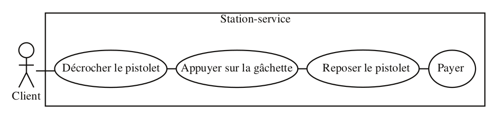
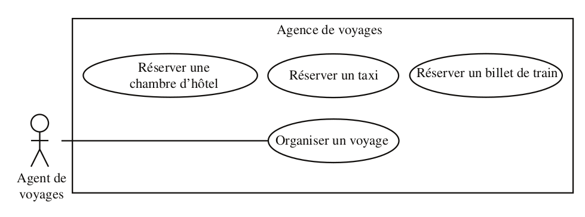
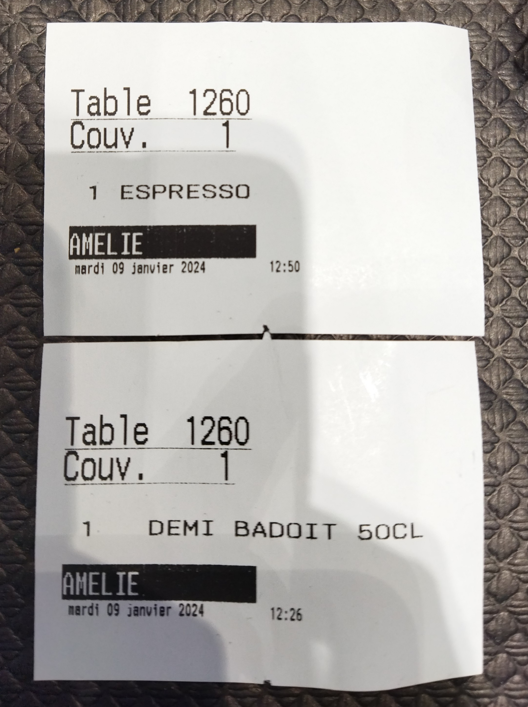
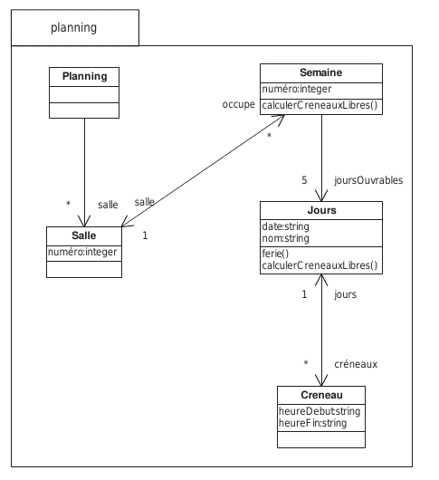
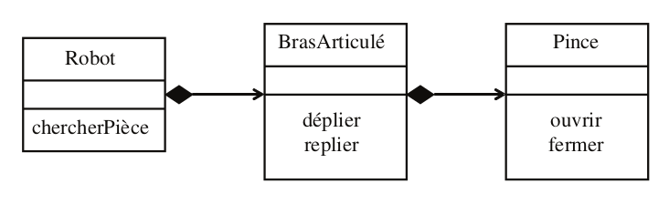

# Problèmes de modélisation UML

- [Problèmes de modélisation UML](#problèmes-de-modélisation-uml)
  - [Diagrammes UML abordés](#diagrammes-uml-abordés)
  - [Partie 1 : Diagrammes de cas d'utilisation, description textuelles des cas d'utilisation (rédaction des spécifications)](#partie-1--diagrammes-de-cas-dutilisation-description-textuelles-des-cas-dutilisation-rédaction-des-spécifications)
    - [Problème 1 : Identification des acteurs et recensement des cas d'utilisation](#problème-1--identification-des-acteurs-et-recensement-des-cas-dutilisation)
    - [Problème 2 : Relations entre cas d'utilisation](#problème-2--relations-entre-cas-dutilisation)
    - [Problème 3 : Cas internes](#problème-3--cas-internes)
    - [Problème 4 : Identification des acteurs, recensement des cas d'utilisation et relations entre cas](#problème-4--identification-des-acteurs-recensement-des-cas-dutilisation-et-relations-entre-cas)
    - [Problème 5 : Description textuelle d'un cas d'utilisation](#problème-5--description-textuelle-dun-cas-dutilisation)
    - [Problème 6 : Relations entre acteurs, extensions conditionnelles entre cas d'utilisation](#problème-6--relations-entre-acteurs-extensions-conditionnelles-entre-cas-dutilisation)
    - [Problème 7 : Application](#problème-7--application)
  - [Partie 2 : Diagrammes de classes](#partie-2--diagrammes-de-classes)
    - [Problème 1 : Propriétés d'une classe](#problème-1--propriétés-dune-classe)
    - [Problème 2 : Classe stéréotypée](#problème-2--classe-stéréotypée)
    - [Problème 3 : Exploration à partir de données](#problème-3--exploration-à-partir-de-données)
    - [Problème 4 : Associations](#problème-4--associations)
    - [Problème 5 : Héritage](#problème-5--héritage)
    - [Problème 6 : Classe active](#problème-6--classe-active)
    - [Problème 7 : Associations et cardinalité](#problème-7--associations-et-cardinalité)
    - [Problème 8 : Savoir comprendre et utiliser un diagramme de classes](#problème-8--savoir-comprendre-et-utiliser-un-diagramme-de-classes)
    - [Problème 9 : Aspect dynamique, traduction d'un diagramme de séquence en diagramme de communication](#problème-9--aspect-dynamique-traduction-dun-diagramme-de-séquence-en-diagramme-de-communication)

## Diagrammes UML abordés

-   Diagramme de cas d'utilisation et scénarios
-   Diagramme de classes
-   Diagramme de séquence
-   Diagramme de communication
-   Diagramme d'états transitions
-   Diagramme d'activités

## Partie 1 : Diagrammes de cas d'utilisation, description textuelles des cas d'utilisation (rédaction des spécifications)

### Problème 1 : Identification des acteurs et recensement des cas d'utilisation

Considérons le système informatique qui gère une station-service de
distribution d'essence. On s'intéresse à la modélisation de la prise
d'essence par un client.

1.  Le client se sert de l'essence de la façon suivante. Il prend un
    pistolet accroché à une pompe et appuie sur la gâchette pour prendre
    de l'essence. Qui est *l'acteur* du système ? Est-ce le *client*, le
    *pistolet* ou la *gâchette* ? **Réaliser un diagramme de cas
    d'utilisation**.
2.  Le pompiste peut se servir de l'essence pour sa voiture. Est-ce un
    nouvel *acteur* ?
3.  La station a un gérant qui utilise le système informatique pour des
    opérations de gestion. Est-ce un nouvel *acteur* ?
4.  La station-service a un petit atelier d'entretien de véhicules dont
    s'occupe un mécanicien. Le gérant est remplacé par un chef d'atelier
    qui, en plus d'assurer la gestion, est aussi mécanicien. **Comment
    modéliser et représenter cela sur le diagramme de cas d'utilisation
    ?**

### Problème 2 : Relations entre cas d'utilisation

Quel est le défaut du diagramme suivant ?

### Problème 3 : Cas internes

**Choisissez** et **dessinez** les relations entre les cas suivants :

1.  Une agence de voyages organise des voyages où l'hébergement se fait
    en hôtel. Le client doit disposer d'un taxi quand il arrive à la
    gare pour se rendre à l'hôtel.

2.  Certains clients demandent à l'agent de voyages d'établir une
    facture détaillée. Cela donne lieu à un nouveau cas d'utilisation
    appelé « Établir une facture détaillée ». **Comment mettre ce cas en
    relation avec les cas existants ?**

3.  Le voyage se fait soit par avion, soit par train. **Comment
    modéliser cela ?**

### Problème 4 : Identification des acteurs, recensement des cas d'utilisation et relations entre cas

**Modélisez** avec un diagramme de cas d'utilisation le fonctionnement
d'un distributeur automatique de *cassettes vidéo* (oui, je sais, cela
n'existe plus...) dont la description est donnée ci-après.

Une personne souhaitant utiliser le distributeur doit avoir une carte
magnétique spéciale. Les cartes sont disponibles au magasin qui gère le
distributeur. Elles sont créditées d'un certain montant en euros et
rechargeables au magasin. Le prix de la location est fixé par tranches
de 6 heures (1 euro par tranche). Le fonctionnement du distributeur est
le sui- vant : le client introduit sa carte ; si le crédit est supérieur
ou égal à 1 euro, le client est autorisé à louer une cassette (il est
invité à aller recharger sa carte au magasin sinon) ; le client choisit
une cassette et part avec ; quand il la ramène, il l'introduit dans le
distribu- teur puis insère sa carte ; celle-ci est alors débitée ; si le
montant du débit excède le crédit de la carte, le client est invité à
régulariser sa situation au magasin et le système mémorise le fait qu'il
est débiteur ; la gestion des comptes débiteurs est prise en charge par
le person- nel du magasin. On ne s'intéresse ici qu'à la location des
cassettes, et non à la gestion du distributeur par le personnel du
magasin (ce qui exclut la gestion du stock des cassettes).

### Problème 5 : Description textuelle d'un cas d'utilisation

**Décrivez sous forme textuelle** les cas d'utilisation « Emprunter une
vidéo » du diagramme de l'exercice 6.

La recherche d'une vidéo peut se faire par genres ou par titres de film.
Les différents genres sont action, aventure, comédie et drame. Quand une
liste de films s'affiche, le client peut trier les films par titres ou
par dates de sortie en salles.

### Problème 6 : Relations entre acteurs, extensions conditionnelles entre cas d'utilisation

**Modélisez** à l'aide d'un diagramme de cas d'utilisation une
médiathèque dont le fonction- nement est décrit ci-après. Commencez par
identifier les acteurs.

Une petite médiathèque n'a qu'une seule employée qui assume toutes les
tâches :

-   la gestion des œuvres de la médiathèque ;
-   la gestion des adhérents.

Le prêt d'un exemplaire d'une œuvre donnée est limité à trois semaines.
Si l'exemplaire n'est pas rapporté dans ce délai, cela génère un
contentieux. Si l'exemplaire n'est toujours pas rendu au bout d'un an,
une procédure judiciaire est déclenchée.

L'accès au système informatique est protégé par un mot de passe.

### Problème 7 : Application

1.  **Réaliser le diagramme de cas d'utilisation** [du jeu
    *Timeguessr*](https://timeguessr.com/)
2.  **Réaliser la description textuelle** du cas d'utilisation *jouer
    une partie*

## Partie 2 : Diagrammes de classes

### Problème 1 : Propriétés d'une classe

**Proposez une modélisation**, en vue d'une implémentation informatique,
de la situation suivante en mettant en évidence les différents
compartiments et ornements des classes.

**Réalisez** la modélisation étape par étape, en faisant apparaître, en
fonction des connaissances disponibles, les changements du modèle.

1.  Une personne est caractérisée par son nom, son prénom, son sexe et
    son âge. Les responsabilités de la classe sont entre autres le
    calcul de l'âge, le calcul du revenu et le paiement des charges. Les
    attributs de la classe sont privés ; le nom, le prénom ainsi que
    l'âge de la personne font partie de l'interface de la classe
    Personne.

2.  Deux types de revenus sont envisagés, le salaire et toutes les
    sources de revenus autres que le salaire, qui sont tous deux
    représentés par des entiers. On calcule les charges en appliquant un
    coefficient fixe de 15 % sur les salaires et un coefficient de 20 %
    sur les autres revenus.

3.  Un objet de la classe `Personne` peut être créé, en particulier, à
    partir du nom et de la date de naissance. Il est possible de changer
    le prénom d'une personne. Par ailleurs, le calcul des charges ne se
    fait pas de la même manière lorsque la personne décède.

### Problème 2 : Classe stéréotypée

Soit la classe nommée `Trigonometry`. Cette classe a pour rôle de
regrouper un ensemble d'outils mathématiques universels. Elle doit
mettre à disposition :

-   Une constante globale nommée `PI` représentant la valeur du nombre
    $\pi$.
-   Trois fonctions de calcul prenant un angle en paramètre (un nombre
    réel) et retournant un résultat réel :
    -   sin
    -   cos
    -   tan

**Proposez le diagramme de la classe** `Trigonometry` en respectant les
standards UML.

### Problème 3 : Exploration à partir de données

Voici deux *tickets de caisse* émis par un bistrot pour un client.

A partir des **informations** sur les tickets et de **votre connaissance
du métier**, **proposer un diagramme de classes** modélisant le SI du
bistrot. On ne fera figurer sur le diagramme de classes que **les noms
des classes**, **propriétés** (attributs) et **associations entre
classes**, avec leur cardinalités.

### Problème 4 : Associations

Dans le cadre de la modélisation d'une application de gestion
commerciale, on souhaite analyser les relations entre trois entités
principales : Commande, Produit et Date.

Ces trois classes ne sont pas liées de manière indépendante, mais
forment un bloc de relations interdépendantes (une association
ternaire).

1.  **Proposez un diagramme de classes UML** illustrant l'association
    *ternaire* entre les classes `Commande`, `Produit` et `Date`. Vous
    devez positionner correctement les cardinalités (multiplicités) en
    traduisant graphiquement les trois règles de gestion suivantes :

-   Règle A : Pour une commande spécifique et un produit précis, il
    existe obligatoirement et uniquement 2 dates associées.
-   Règle B : Pour une date spécifique et un produit donné, ils ne
    peuvent appartenir qu'à une seule commande au maximum.
-   Règle C : Pour une commande donnée à une date précise, il doit y
    avoir **au minimum 2 produits** et au **maximum 10 produits liés**.

2.  On vous fournit un extrait de la base de données (un ensemble
    d'instances ou de "tuples") représentant l'état actuel du système :

$$\text{Données actuelles} = \{(c_1, p_1, d_1), (c_1, p_2, d_2), (c_2, p_1, d_2), (c_2, p_4, d_4)\}$$

> c (identifiant d'une commande), p (identifiant d'un produit), d(une
> date)

**Démontrez** en quoi cet état actuel de la base de données ne respecte
*pas* les multiplicités que vous avez définies dans le diagramme de la
question 1.

3.  **Complétez** cet ensemble en y ajoutant le nombre minimum de
    *triplets* (commande, produit, date) nécessaires afin que la base de
    données respecte strictement toutes les contraintes de votre modèle
    UML.

### Problème 5 : Héritage

Un·e étudiant·e et un·e enseignant·e sont des personnes particulières.

1.  **Proposez un modèle de classes** correspondant. Un doctorant est un
    étudiant qui assure des enseignements.
2.  **Complétez** le modèle de classes précédent en exploitant au mieux
    les possibilités du lan- gage cible. Un doctorant et un étudiant
    doivent s'inscrire au début de l'année et éventuellement modifier
    leur inscription. En fonction des deux modèles proposés.
3.  **Ajoutez** cette fonctionnalité aux deux précédents modèles.
4.  **Implémenter** le modèle en langage orienté objet (C#, PHP, Java,
    etc.)

### Problème 6 : Classe active

Votre téléphone dispose d'un gestionnaire d'événements qui permet de
suspendre l'activité du téléphone lorsque celui-ci n'est pas sollicité,
d'afficher un message quand un rendez-vous est programmé.

**Proposer** une modélisation UML de ce gestionnaire d'événements.

### Problème 7 : Associations et cardinalité

**Donner** les diagrammes de classes correspondant aux situations
suivantes :

1.  Les personnes qui sont associées à l'université sont des étudiants
    ou des professeurs.
2.  Un rectangle est caractérisé par quatre sommets. Un sommet est un
    point. On construit un rectangle à partir des coordonnées de quatre
    sommets. Il est possible de calculer sa surface et son périmètre et
    de le translater.
3.  Un écrivain possède au moins une œuvre. Ses œuvres sont ordonnées
    selon l'année de publication. Si la première publication est faite
    avant l'âge de dix ans, l'écrivain est dit *précoce*.
4.  Tous les jours, le facteur distribue le courrier aux habitants de sa
    zone d'affectation. Quand il s'agit de lettres, il les dépose dans
    les boîtes aux lettres. Quand il s'agit d'un colis, le destinataire
    du courrier doit signer un reçu. Proposez les classes candidates et
    **déduisez-en le diagramme de classes.**

### Problème 8 : Savoir comprendre et utiliser un diagramme de classes

1.  **Expliquez** le diagramme de classes.
2.  **Implémentez-le** dans un langage de votre choix (en CLI).
    **Réalisez** une démonstration du système pour réserver une salle
    sur un créneau donné.

### Problème 9 : Aspect dynamique, traduction d'un diagramme de séquence en diagramme de communication

Le diagramme de classes présenté à la figure ci-dessous modélise un robot qui dispose d’un bras
articulé se terminant par une pince. Le fonctionnement du robot est le suivant : le robot
déplie son bras, attrape la pièce avec sa pince, replie son bras puis relâche la pièce.

1. **Représenter** à l’aide d’un diagramme de séquence l’échange des messages entre les
objets robot, brasArticulé et pince.
1. **Transformer** le diagramme de séquence en un diagramme de communication.
2. **Écriver** en pseudo-code les classes Robot, BrasArticulé et Pince.
collaboration

> Certains exercices présentés ici sont tirés du livre ["UML2 Pratique
> de la modélisation, 2eme édition
> 2009](https://ia803107.us.archive.org/11/items/PHPMySQLAvecFlash8/UML%202%20Pratique%20de%20la%20mod%C3%A9lisation%20-%202%C3%A8me%20Edition.pdf),
> publié chez collection Synthexn, Pearson Education. Accessible
> gratuitement en ligne ! [Voir également la bibliographie sur le dépôt
> associé au cours.](https://github.com/paul-schuhm/uml-poo)
